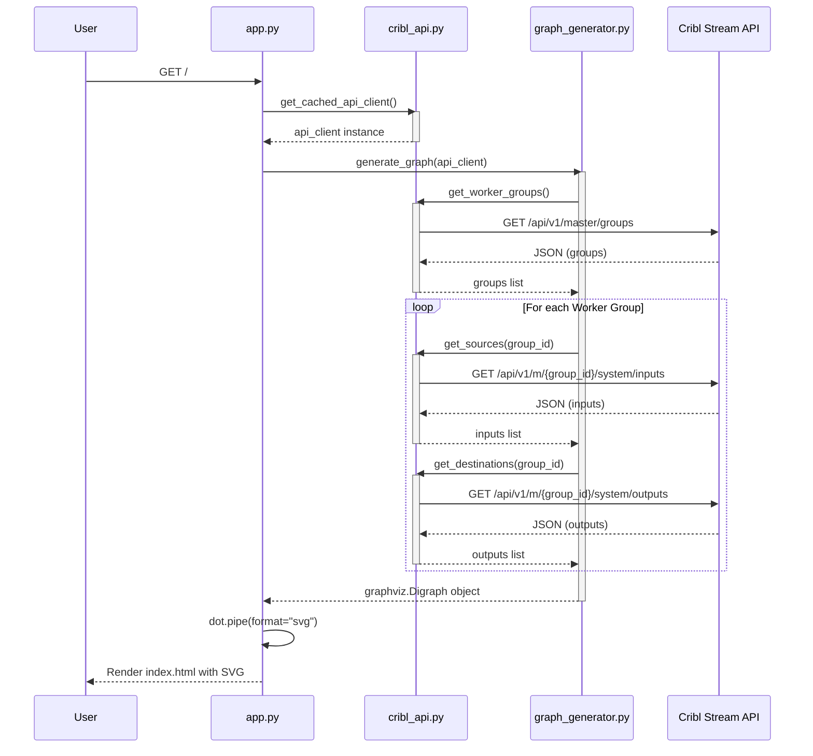

# Architecture Overview

This document provides a high-level overview of the Cribl Pipeline Visualizer architecture.

## System Components

The application consists of the following key components:

1.  **Flask Web Application (`app.py`)**:
    -   Serves as the entry point.
    -   Handles HTTP requests.
    -   Orchestrates data fetching and graph generation.
    -   Renders the final HTML with the SVG graph.

2.  **Cribl API Client (`cribl_api.py`)**:
    -   Manages authentication with the Cribl Stream API.
    -   Handles token management (login, headers).
    -   Provides methods to fetch worker groups, inputs, outputs, and pipelines.
    -   Uses a `requests.Session` for connection pooling.

3.  **Graph Generator (`graph_generator.py`)**:
    -   Takes the `CriblAPI` client as input.
    -   Fetches configuration data (groups, inputs, outputs).
    -   Constructs a Graphviz `Digraph` object.
    -   Defines the visual style (nodes, edges, clusters).

4.  **Templates (`templates/`)**:
    -   `index.html`: Displays the generated SVG.
    -   `error.html`: Displays error messages.

## Data Flow

The following sequence diagram illustrates the data flow when a user requests the visualization:

## Deployment Architecture

The application is containerized using Docker.

-   **Dockerfile**: Builds a Python 3.9 slim image, installs system dependencies (graphviz), and python dependencies.
-   **Docker Compose**: Orchestrates the container, mapping port 8080 (host) to 5000 (container) and setting environment variables.

### Environment Variables

Configuration is managed via environment variables (or `.env` file):
-   `CRIBL_BASE_URL`
-   `CRIBL_AUTH_TOKEN` (or `CRIBL_USERNAME` / `CRIBL_PASSWORD`)
-   `FLASK_DEBUG`
